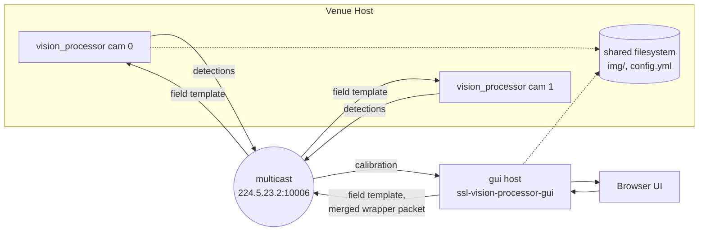
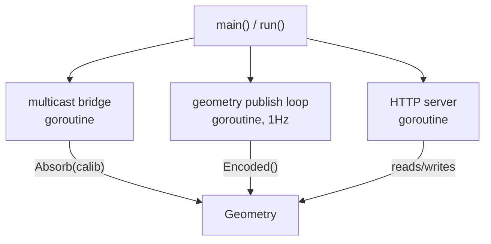
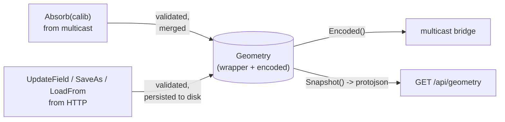
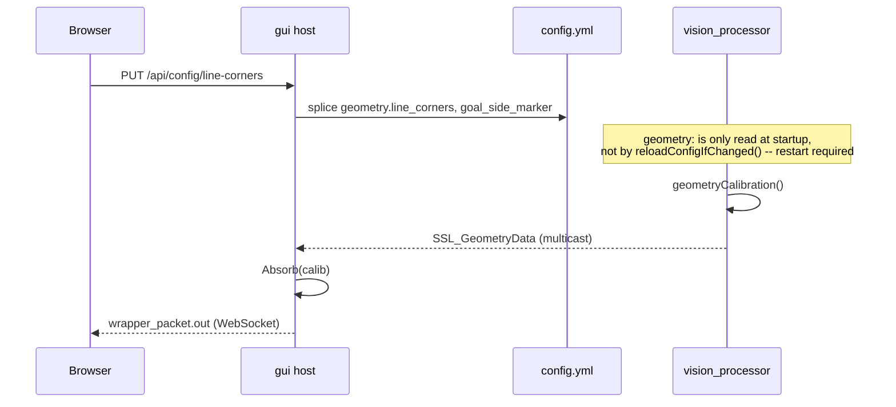

# gui Architecture

This document describes the design of `gui`, the Go host and browser UI for vision_processor. It covers the
subsystem in this directory only. The C++ vision_processor and the Python scripts in `python/` are described in
the root README and are not modified by this subsystem.

`gui` replaces `python/geom_publisher.py` for anyone running it. It is a single Go binary with an embedded
Svelte frontend. It owns the shared field geometry, absorbs camera calibrations from vision_processor instances
over multicast, and serves the frontend, a JSON API, and a WebSocket for live updates, all on one port.

## System overview

A venue runs one or more vision_processor instances, one per camera. Each instance shares a filesystem with the
gui host (debug images in `img/`, the instance's own `config.yml`) and exchanges SSL vision protocol messages
with it over the same multicast group the rest of the league uses.



The gui host does not talk to a vision_processor instance directly. Both sides only ever speak to the multicast
group, the same way any other league consumer would. This keeps the host interchangeable with the legacy
`geom_publisher.py` service from the vision_processor's point of view. The browser talks to the gui host over
HTTP and a WebSocket instead, covered under HTTP API and WebSocket protocol below.

## Process layout

`ssl-vision-processor-gui` is one process with three concurrent responsibilities, wired together in
`cmd/ssl-vision-processor-gui/main.go`.



All three goroutines share one `*geometry.Geometry` instance, guarded by its own mutex. Shutdown is graceful: an
`os.Interrupt`/`SIGTERM` cancels a shared context, the HTTP server drains in-flight requests, and `main` waits for
both other goroutines to exit before returning.

## Package responsibilities

| Package                | Responsibility                                                                 |
| ---------------------- | -------------------------------------------------------------------------------|
| `cmd/ssl-vision-processor-gui` | Flags, wiring, HTTP handlers and routes.                                |
| `internal/geometry`    | Field configuration, calibration merge, the 1Hz publish loop, and the corner picker's config.yml writeback. |
| `internal/multicast`   | Bridge to the SSL vision multicast group.                                     |
| `internal/hub`         | In-process topic pub/sub and the `/ws` WebSocket handler.                     |
| `internal/snapshot`    | Debug image listing and serving.                                              |
| `internal/logging`     | slog setup: a coloured console handler and a rotating file handler.           |
| `internal/vision`, `internal/gamecontroller` | Generated protobuf bindings. Not committed, see Build-time codegen below. |
| `frontend`             | Svelte 5 and TypeScript, embedded into the binary via `//go:embed`.           |

## Data flow: geometry state

`Geometry` holds one `SSL_WrapperPacket`: the field template plus every camera's absorbed calibration. It keeps a
cached protobuf encoding alongside the live message, since `proto.Marshal` writes to the message's own size cache
and is not safe to call from multiple goroutines without a lock.



A calibration missing a required proto2 field is rejected with `proto.CheckInitialized` before it can touch
`State`, so a malformed message from one instance never desyncs the held message from its cached encoding. A
field edit that fails to persist to disk (`UpdateField`, `SaveAs`) is rolled back the same way, so the live,
broadcast state never claims a change that was never actually saved.

## Data flow: corner picker calibration hint

The corner picker lets an operator mark the field's first calibration corner directly on a debug snapshot in the
browser, instead of estimating pixel coordinates by eye. It writes into the target instance's own `config.yml`,
not into the shared `geometry.yml`.



`internal/geometry.WriteLineCorners` edits `config.yml` as text, not as decoded and re-encoded YAML. The file
ships full of comments and commented out example values meant for a human to read, and a decode and re-encode
round trip through the YAML library does not reliably preserve those. A line based splice touches only the two
keys it is asked to set.

The `geometry:` section is only read once, when `Resources` is constructed at process startup
(`src/Resources.cpp`). `reloadConfigIfChanged()` hot reloads `thresholds`, `tracking`, `color`, and `debug` every
half second, but never `geometry`, `camera`, `network`, or `stream`. A corner saved through this endpoint has no
effect until the target vision_processor instance is restarted.

## HTTP API

All routes are registered in `cmd/ssl-vision-processor-gui/routes.go`.

| Method | Path                          | Purpose                                                             |
| ------ | ----------------------------- | -------------------------------------------------------------------|
| GET    | `/api/health`                 | Liveness check.                                                     |
| GET    | `/api/geometry`                | The full wrapper packet, as canonical protojson.                   |
| GET    | `/api/geometry/field`          | The editable field dimensions and optional line toggles.           |
| PUT    | `/api/geometry/field`          | Update the field dimensions, persisted to the current geometry file. |
| POST   | `/api/geometry/field/save-as`  | Save the field config to a new file and switch to editing it.      |
| POST   | `/api/geometry/field/load`     | Discard the current field config and load another file.            |
| GET    | `/api/geometry/presets`        | The rulebook presets, read live from `geometry-divA.yml`/`geometry-divB.yml`. |
| GET    | `/api/config/line-corners`     | The corner picker's last saved corners and goal side marker.        |
| PUT    | `/api/config/line-corners`     | Save the corner picker's calibration hint to `config.yml`.          |
| GET    | `/api/snapshots`               | List of debug images currently on disk.                            |
| GET    | `/api/snapshot/{camID}/{view}` | One debug image.                                                    |
| GET    | `/ws`                          | WebSocket, see below.                                               |

An unrouted `/api/*` path returns 404 rather than falling through to the frontend, so a typo'd endpoint fails
with a clear status instead of returning HTML to a caller expecting JSON. Every other path serves the embedded
frontend, with a fallback to `index.html` for client side routes.

## WebSocket protocol

`/ws` is a single connection carrying a topic based publish/subscribe protocol, implemented in `internal/hub`.

```json
// client -> server
{ "action": "subscribe",   "topic": "wrapper_packet.out" }
{ "action": "unsubscribe", "topic": "wrapper_packet.out" }
// server -> client
{ "topic": "wrapper_packet.out", "data": { /* protojson */ } }
```

`wrapper_packet.out` carries the current `SSL_WrapperPacket` as canonical protojson, published once per second.
Every channel in this path, from a topic's own subscriber channel to a connection's shared outbound channel, is
size limited and drops the oldest queued value in favor of the newest one. A slow client sees only the latest
value once it catches up, never a growing backlog of stale ones.

## Build-time codegen

`internal/vision`, `internal/gamecontroller`, and `frontend/src/proto` are `buf generate` output and are not
committed. `buf.gen.yaml` uses local plugins (`go tool protoc-gen-go`, `protoc-gen-es` from the frontend's own
`node_modules`), so generation needs no network beyond the already checked out `proto/` submodule. `gui/Makefile`
regenerates them as an ordinary build prerequisite. See `gui/README.md` for the exact commands.

## Not yet built

- **Discovery.** Parsing `SSL_VPConfig` announces off multicast into an instance table. The C++ side does not
  emit these yet.
- **Host owned config push.** Diffing an instance's announced config against a desired one and pushing the
  difference, rather than editing its `config.yml` by hand as the corner picker does today.
- **Remote video.** `internal/snapshot` assumes the gui host and the vision_processor instance share a
  filesystem. This does not hold once instances run on other hosts.
